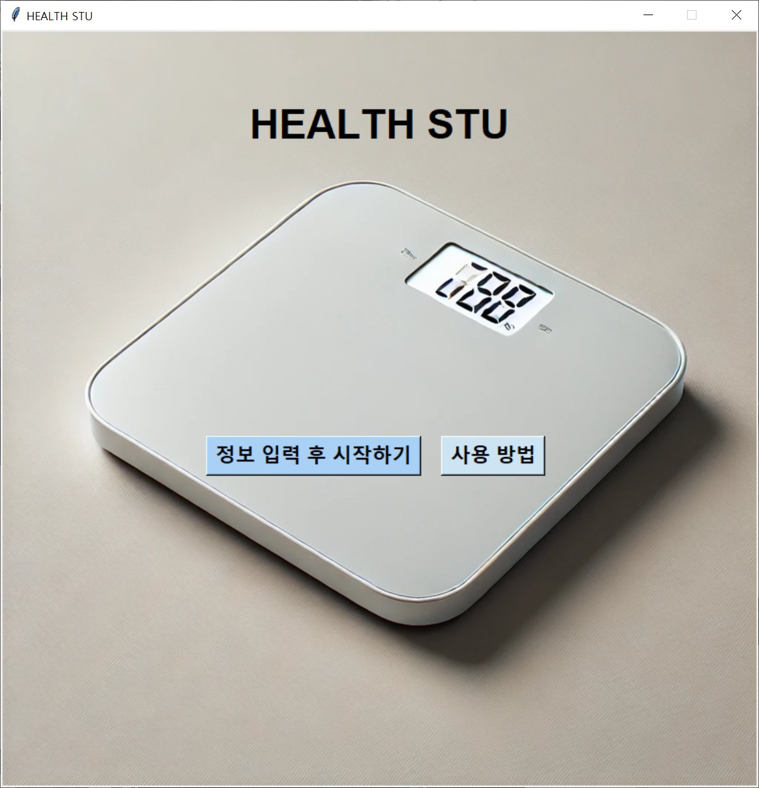
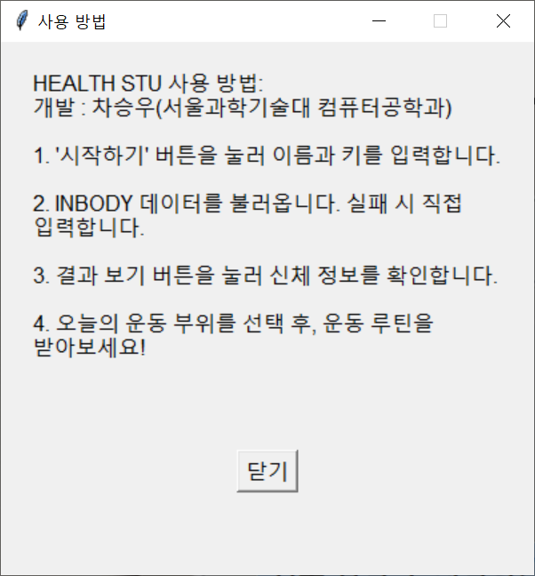
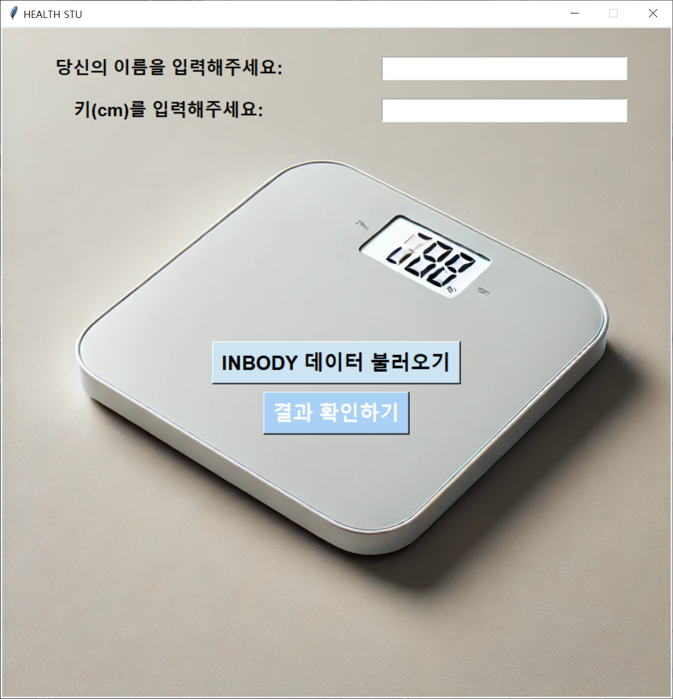
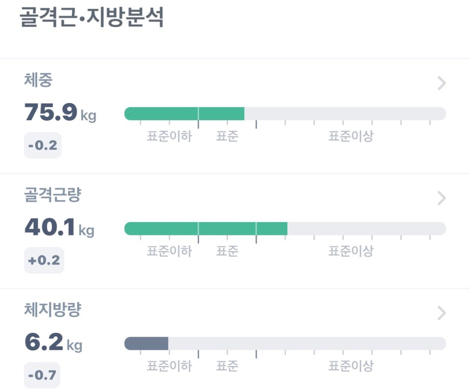
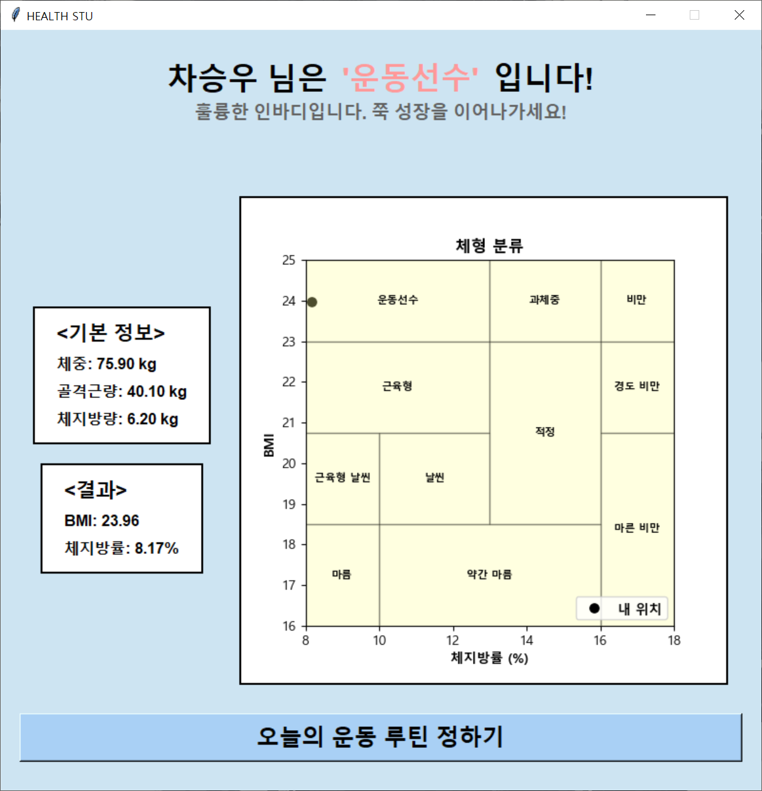
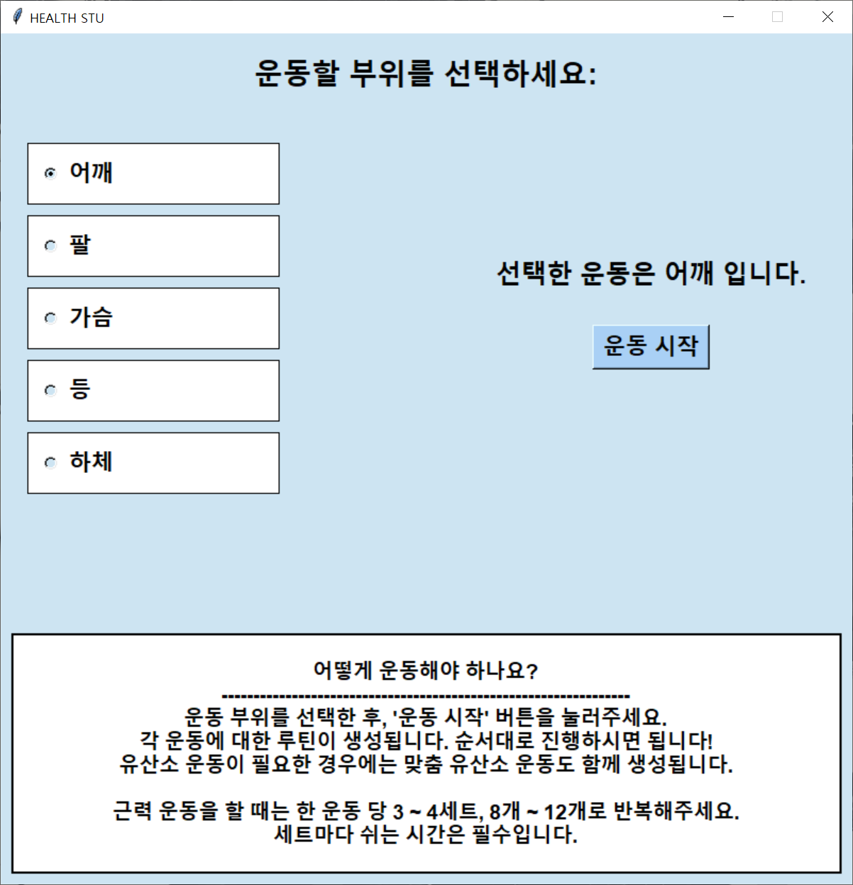
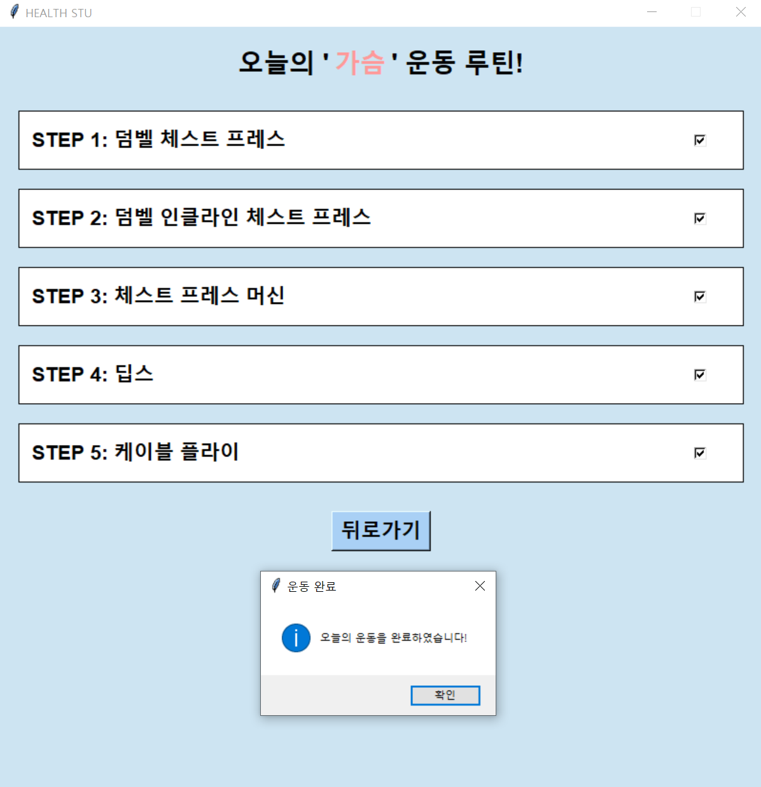

# **HealthSTU** 🏋️‍♂️

오늘 소개해 드릴 프로그램은 **HealthSTU**입니다.

---

## **목차**
1. [**개발 동기 (Motivation) 🔍**](#개발-동기-motivation-)  
2. [**설치 (Installation) 💻**](#설치-installation-)  
3. [**실행 (Run) ▶️**](#실행-run-)  
4. [**주요 기능 (How It Works?) 🚀**](#주요-기능-how-it-works-)  
5. [**코드 설명 (Explanation) 📜**](#코드-설명-explanation-)  
6. [**파이썬 라이브러리 (Python Libraries) 🐍**](#파이썬-라이브러리-python-libraries-)  
7. [**참고 자료 📚**](#참고-자료-)  
8. [**향후 개발 계획 🌟**](#향후-개발-계획-)  

---

## **개발 동기 (Motivation) 🔍**
인바디 데이터 내에는 다양한 정보들은 많지만, 이 정보들을 어떻게 해석해야 할 지, 또 어떤 방향성을 가지고, 어떤 루틴으로 운동을 헤야 할지 많은 사람들이 고민하곤 합니다.
**HealthSTU**는 건강 관리 및 운동 루틴을 위한 솔루션입니다.
프로그램을 통해서 내 몸 상태에 맞는 운동 팁, 운동 루틴을 찾아봐요!

---

## **설치 (Installation) 💻**

---

### 1. **Python 설치**  
HealthSTU를 실행하려면 Python이 필요합니다.  
공식 홈페이지에서 Python을 다운로드하고 설치하세요:  
[**Python 공식 다운로드 페이지**](https://www.python.org/downloads/)

### 2. **Pytesseract 설치**  
OCR 기능을 사용하려면 Pytesseract가 필요합니다.  
아래 단계를 따라 설치하세요:

1. **Tesseract 설치**  
    Pytesseract는 Tesseract OCR 라이브러리를 기반으로 동작합니다.  
    [**Tesseract 공식 다운로드 페이지**](https://github.com/tesseract-ocr/tesseract)에서 설치 파일을 다운로드하세요.

2. **Python 패키지 설치**  
    아래 명령어를 사용해 Pytesseract 라이브러리를 설치합니다:
    ```bash
    pip install pytesseract
    ```

3. **한국어 데이터 파일 추가**  
    Tesseract에서 한국어를 지원하려면 한국어 데이터 파일이 필요합니다.  
    아래 링크에서 `kor.traineddata`를 다운로드한 후 Tesseract의 `tessdata` 폴더에 넣어주세요.
    - [**한국어 데이터 다운로드 링크**](https://github.com/tesseract-ocr/tessdata_best/blob/main/kor.traineddata)  
    - **폴더 위치**  
        - **Windows**: `C:\Program Files\Tesseract-OCR\tessdata`  
        - **macOS/Linux**: `/usr/local/share/tessdata`

### 3. **파이썬 라이브러리 설치**
필요한 파이썬 라이브러리를 아래 명령어로 설치합니다:

```bash
pip install matplotlib Pillow tk
```

---

## **실행 (Run) ▶️**

---

**main.py** 항목을 실행합니다.
- 메인 화면에서는 시작하기, 사용 방법을 확인할 수 있습니다.




프로그램을 시작하면 이름과 키, 그리고 인바디 데이터를 입력하게 됩니다.
인바디 데이터는 스마트폰의 인바디 앱 내 이미지를 통해 가져올 수 있습니다.
이미지를 삽입할 때는 화면을 캡처한 후, 불필요한 부분을 제거하고 예시 이미지와 같게 잘라서 사용해 주세요.





프로그램은 입력된 데이터를 바탕으로 BMI와 체지방률을 계산하고, 사용자의 체형을 분석합니다. 결과는 숫자와 그래프로 시각화되어 신체 정보를 쉽게 확인할 수 있습니다.



운동하기 버튼을 통해 운동 루틴을 생성할 수 있습니다. 운동 루틴은 사용자의 체형에 맞춰 맞춤 루틴으로 생성됩니다.
원하는 운동 부위를 골라 최적의 운동 루틴을 확인할 수 있습니다.



운동 체크리스트를 통해 진행 상황을 기록할 수 있습니다. 



---

## **주요 기능 (How It Works?) 🚀**

---

### 1. 체형 분석
인바디 데이터를 입력하면 아래 항목을 기준으로 여러분의 건강 상태를 분석합니다.
- **키**
- **몸무게**
- **골격근량**
- **체지방량**

"체형 분석 결과로 본인의 신체 상태를 정확히 파악할 수 있습니다.
- **운동 선수**
- **과체중**
- **마른 비만 등**

### 2. 운동 방향성 제시
분석된 체형에 따라 최적의 운동 전략과 방안을 제안합니다.
- 체형 분석 결과에 따라 **효과적인 운동 전략** 제시

### 3. 운동 루틴 생성
원하는 신체 부위에 따라 맞춤형 운동 루틴을 생성합니다:
1. **근력 운동 루틴**:
2. **유산소 운동 루틴**:
- 체지방 감소가 필요한 체형일 때 유산소 루틴 제공

**👉 프로그램이 제공하는 운동 루틴을 통해 효율적으로 목표를 달성하세요!**

---

## **코드 설명 (Explanation) 📜**

---

### main.py
- 프로그램의 핵심 실행 파일로, 전체적인 흐름과 동작을 관리합니다.

### ui_components.py
- 사용자 인터페이스를 총괄하며, 화면 구성 요소의 디자인, 버튼 동작 설정, 그리고 필요한 함수 호출을 담당합니다.

### ocr_processing.py
- 이미지에서 인바디 데이터를 포함한 유의미한 정보를 추출하고 가공하는 역할을 합니다.

### calculations.py
- BMI, 체지방률 등의 주요 지표를 계산하여 결과를 제공합니다.

### body_type_messages.py
- 체형 분석 결과를 바탕으로 운동의 방향성을 제시하는 맞춤형 메시지를 제공합니다.

### routine_generator.py
- 체형 및 운동 목표에 맞는 맞춤 운동 루틴을 생성합니다.

---

## **파이썬 라이브러리 (Python Libraries) 🐍**

---

이 프로젝트는 다양한 기능을 수행하기 위해 여러 파이썬 라이브러리를 사용합니다. 아래는 주요 라이브러리와 그 용도에 대한 설명입니다.

### 1. GUI 개발 관련
- **`tkinter`**
  - GUI(그래픽 사용자 인터페이스)를 생성하는 기본 Python 라이브러리입니다.
  - 파일 다이얼로그, 버튼, 입력 창 등 GUI 구성 요소를 구현하는 데 사용합니다.
- **`tkinter.filedialog`**
  - 파일 열기 및 저장 대화 상자를 제공합니다.
- **`tkinter.messagebox`**
  - 알림 창 및 메시지 박스를 표시합니다.

### 2. 이미지 처리 및 OCR (Optical Character Recognition)
- **`Pillow (PIL)`**
  - 이미지를 열고, 변환하며, 필터를 적용하는 등 이미지 처리를 담당합니다.
  - 예를 들어, 이미지를 흑백으로 변환하거나 특정 필터를 적용할 때 사용합니다.
- **`pytesseract`**
  - Tesseract OCR 엔진을 활용하여 이미지에서 텍스트를 추출합니다.

### 3. 데이터 처리 및 계산
- **`matplotlib`**
  - 데이터를 시각화하기 위한 그래프 및 차트를 생성합니다.
  - 이 프로젝트에서는 BMI와 체지방률 관련 그래프를 출력하는 데 사용합니다.
- **`random`**
  - 루틴 및 운동 계획을 생성하기 위한 임의 데이터를 생성합니다.

### 4. 프로젝트 구조 및 OS 관련
- **`os`**
  - 파일 경로를 처리하고 운영 체제와 상호 작용합니다.
- **`sys`**
  - 시스템 관련 작업, 특히 경로 설정 및 환경 변수 조작을 수행합니다.

---

## **참고 자료 📚**

---

이 프로젝트는 **인바디 데이터**를 활용하여 BMI, 체지방률 및 신체 유형을 분석하고 운동 루틴을 생성합니다. 더 자세한 정보는 인바디 공식 홈페이지를 참고하세요:

[인바디 공식 홈페이지](https://www.inbody.com)

---

## **향후 개발 계획 🌟**

**HealthSTU**는 사용자의 피드백과 데이터를 바탕으로 지속적으로 개선될 예정입니다. 다음은 향후 추가될 주요 기능들입니다:

### 1. 운동 루틴 세분화
- 현재 제공되는 운동 루틴을 더욱 세분화하여 사용자의 신체 상태, 목표, 체형에 맞춘 **최적의 운동 루틴**을 제공합니다.
- 체지방 감소, 근육 증가, 체형 교정을 위한 맞춤형 루틴 추가.

### 2. 사용자 등록 및 운동 일지 기능
- **사용자 등록 시스템**을 도입하여 개인 계정을 생성할 수 있도록 합니다.
- 사용자 계정을 통해 운동 일지를 작성하고 저장할 수 있으며, 이를 기반으로 운동 성과를 시각적으로 분석하는 기능을 제공합니다.

### 3. 사용자 정의 루틴 추가 기능
- 사용자가 자신의 운동 루틴을 자유롭게 추가하거나 수정할 수 있는 기능을 도입할 예정입니다.
- 개인화된 루틴을 저장하고 관리하여 **유연한 운동 계획**을 지원합니다.

---

**HealthSTU**는 위의 기능들을 통해 사용자에게 더욱 개인화된 운동 관리 솔루션을 제공할 계획입니다. 앞으로도 많은 관심과 피드백 부탁드립니다! 💪

## License
This project is licensed under the MIT License - see the [LICENSE.txt](LICENSE.txt) file for details.